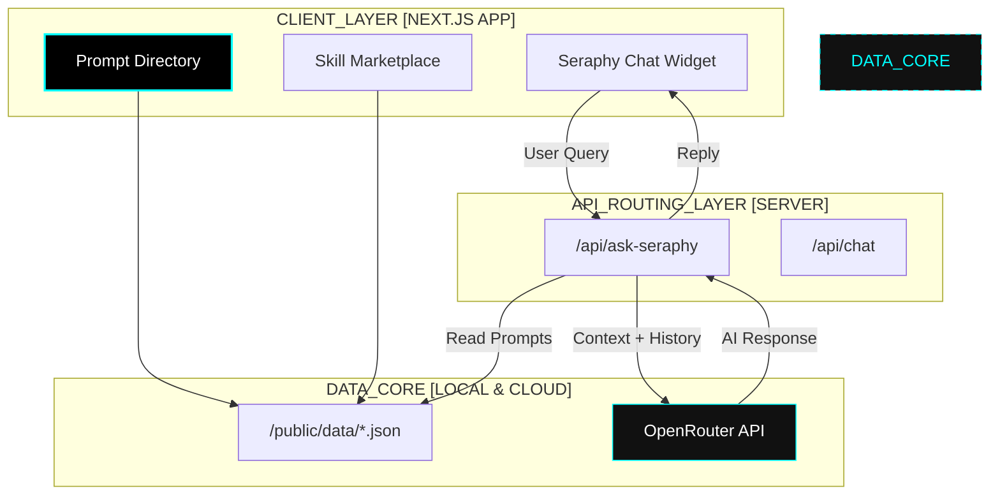

# SERAPHY AGENT // DIRECTORY

> **Next-Gen AI Prompt Library & Skill Marketplace**

<div align="center">
  
</div>

[]()
[]()
[]()
[](LICENSE)

## 📡 The Transmission

SERAPHY AGENT is a centralized hub for discovering, sharing, and utilizing high-performance AI prompts and specialized agent skills.

We don't just list prompts; we provide an interactive ecosystem where developers and creators can find the exact tools they need to supercharge their workflows.

**Seraphy**, our resident AI guide, is always online—ready to help you navigate through thousands of prompts and skills with a friendly, anime-inspired personality.
Powered by **OpenRouter** and **GPT-4o-mini**, Seraphy understands your context and suggests the perfect resources instantly.

---

## 🎨 Assets

- **Logo**: `public/logo.jpeg` - The official Seraphy Agent mascot image

---

## 🏗️ System Architecture



## 🛠️ Tech Stack

### Interface Layer
* **Next.js 16 + TypeScript:** Cutting-edge React framework with App Router for optimal performance.
* **Tailwind CSS v4:** Utility-first styling with a custom cyberpunk/neon aesthetic.
* **Lucide React:** Beautiful, consistent iconography.
* **Framer Motion (Compatible):** Smooth animations and transitions.

### Neural Core (AI Engine)
* **Intelligence Layer:** Integrated with **OpenRouter** (powering Seraphy with **GPT-4o-mini**) for context-aware recommendations.
* **Data Persistence:** Local JSON-based data architecture for fast, zero-latency content delivery.
* **Agent Logic:** 
  - **Context Injection:** Seraphy reads the prompt database in real-time to give accurate suggestions.
  - **Persona System:** Custom system prompts defining Seraphy's helpful, anime-style personality.

---

## 🚀 Key Features

- **PROMPT DIRECTORY:** A vast, searchable collection of high-quality prompts for coding, writing, and marketing.
- **SKILL MARKETPLACE:** Discover specialized AI skills and agents (Web Dev, DevOps, Research) to enhance your own bots.
- **ASK SERAPHY:** An always-on chat assistant that knows every prompt in the database and guides you to the right one.
- **SMART FILTERING:** Color-coded categories and tags make finding resources intuitive and fast.
- **RESPONSIVE DESIGN:** Fully optimized mobile and desktop experience with a modern, clean UI.

---

## 🔧 Environment Setup

Create a `.env.local` file in the root directory:

```bash
# Required for Seraphy Chat Assistant
OPENROUTER_API_KEY=your_openrouter_key_here
```

Install dependencies and start the terminal:

```bash
# Install packages
pnpm install

# Run development server
pnpm dev
```

Open [http://localhost:3000](http://localhost:3000) to see the application.

---

## 🤝 Contributing

We welcome contributions! Whether you're adding new prompts to `prompts.json` or improving the UI.
Please read our [CONTRIBUTING.md](CONTRIBUTING.md) for details on our code of conduct and the process for submitting pull requests.

## 📄 License

This project is licensed under the MIT License - see the [LICENSE](LICENSE) file for details.

<div align="center">
  <sub>SERAPHY AGENT © 2026 • Your Gateway to AI Mastery</sub>
</div>
